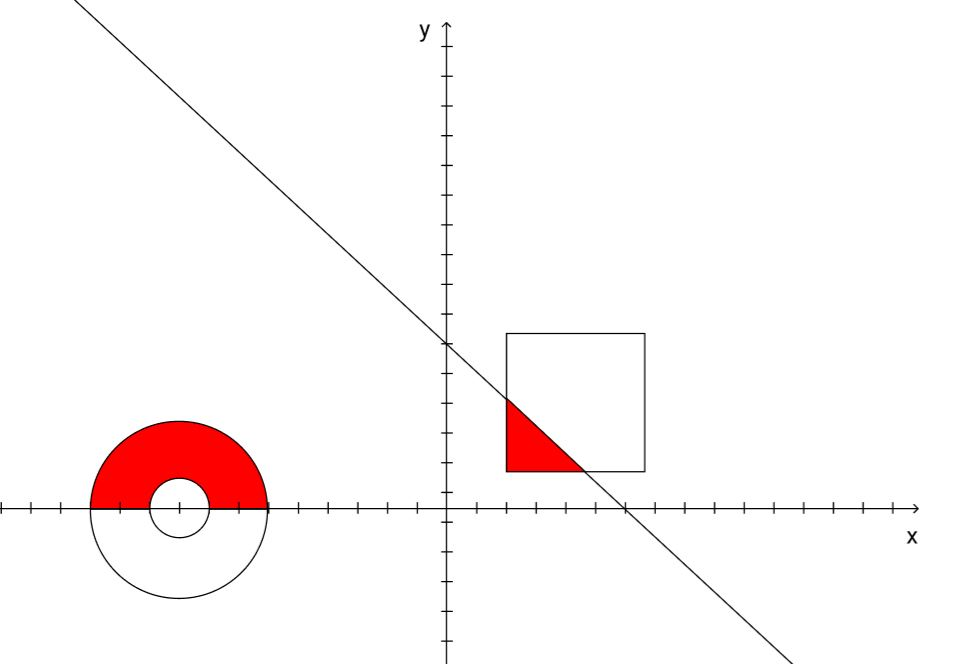

# Подготовка за контролно

1. Проверете дали въведена точка е в оцветените с червено области.

    Вход: x, y на точка, докато не се въведе нещо различно от число или не се достигне максимума от 32 точки.

    Изход: вътре | вън

    При прекратяване на програмата да се изведе списък с всички точки в следния вид: "<x, y>: вътре | вън, n-поредност в списъка на точки за вътре и вън", накрая да се изведе съотношението на точките и дали точката е била в pokeball-а или в триъгълника.
    
    

2. Задача 1 от https://github.com/manjymon/UP2019/tree/master/exercises/06%20-%20Test%20Prep

3. Задача 2 от https://github.com/manjymon/UP2019/tree/master/exercises/06%20-%20Test%20Prep

За домашно: Поразровете се в https://github.com/manjymon/UP2019/tree/master/exercises 👌